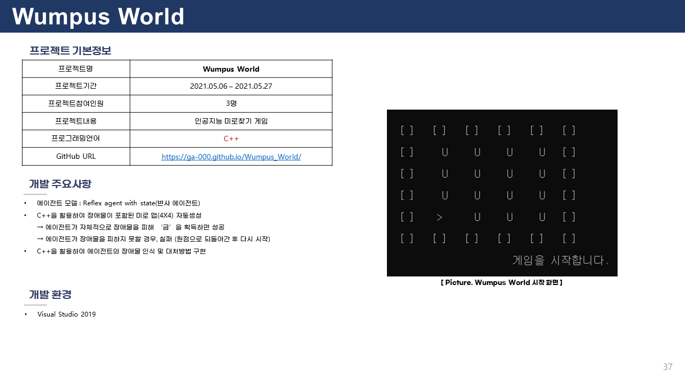
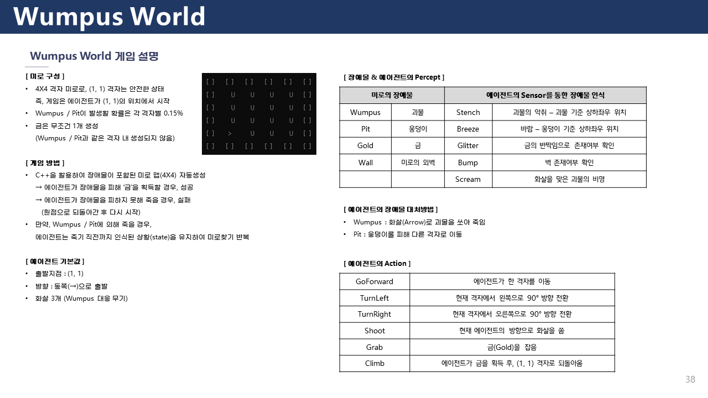
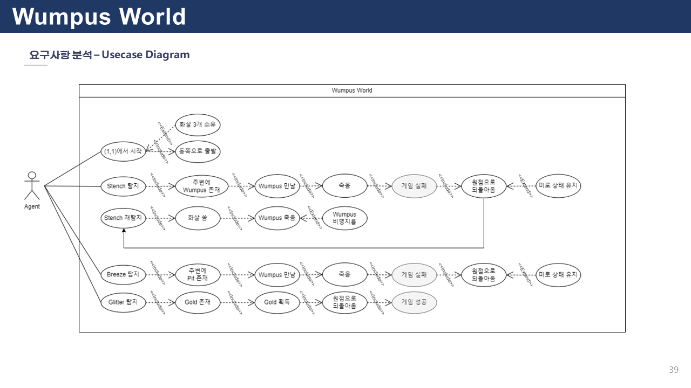
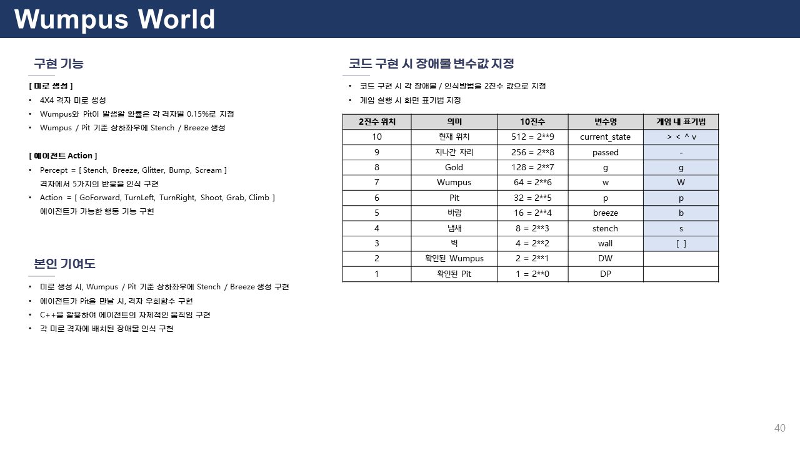
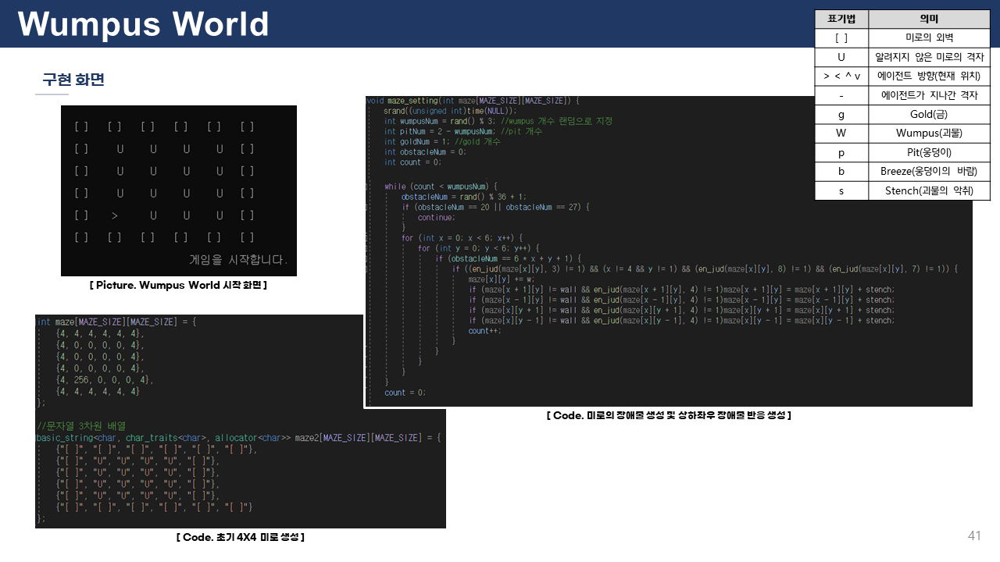
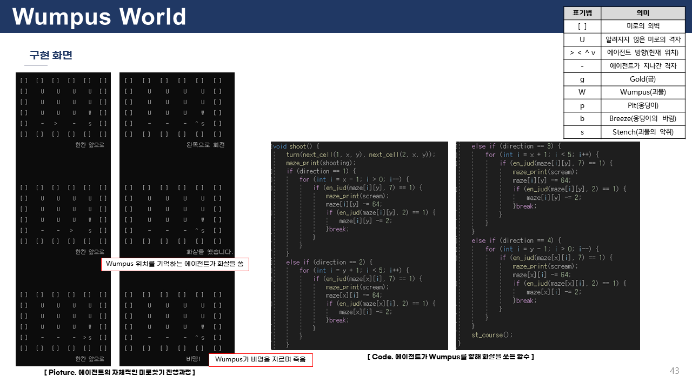
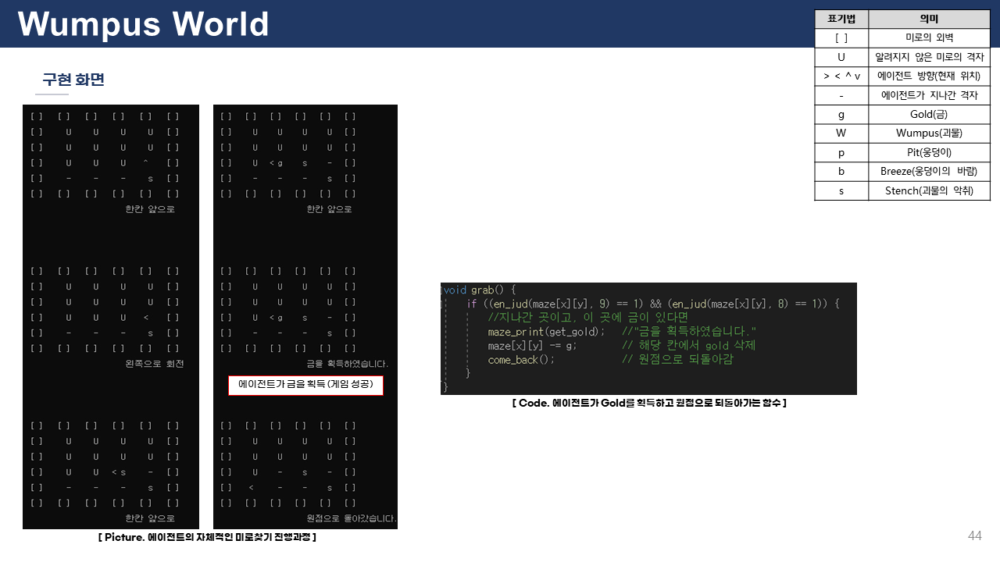

# 🏁 Wumpus World 🏁
This is a **Wumpus World** in which an agent passes through a maze to avoid obstacles to pick up gold himself.

You can access this link <https://ga-000.github.io/Wumpus_World/>

* 에이전트가 장애물을 피해 미로를 탐색하다가 금을 발견하고 원점으로 되돌아올 경우, 미션 성공
* 에이전트가 장애물을 만나 죽을 경우, 원점으로 돌아오면서 미션 실패
* 게임 시작 시, 랜덤으로 미로 생성
* 에이전트의 시작위치는 좌측하단 고정

<br/>

## ⚙ Requirement
For building and running the applicaion you need:
* `Visual Studio 2019`
  * C++


<br/>

## 🎮 기능
* 미로 규격  :  `4 X 4`
```C++
  basic_string<char, char_traits<char>, allocator<char>> maze2[MAZE_SIZE][MAZE_SIZE] = { //문자열 3차원 배열
      {"[ ]", "[ ]", "[ ]", "[ ]", "[ ]", "[ ]"},
      {"[ ]", "U", "U", "U", "U", "[ ]"},
      {"[ ]", "U", "U", "U", "U", "[ ]"},
      {"[ ]", "U", "U", "U", "U", "[ ]"},
      {"[ ]", "U", "U", "U", "U", "[ ]"},
      {"[ ]", "[ ]", "[ ]", "[ ]", "[ ]", "[ ]"}
  };
  ```



  
* 미로 표기 기호  

|표기기호|내용|CPP 코드 내 변수값|
|:---:|:---:|:---:|
|`>`|Agent의 현재 위치|int current_state = 512|
|`U`|공개되지 않은 미로||
|`-`|Agent가 탐색하고 지나간 자리|int passed = 256|
|`g`|금 위치|int g = 128|
|`w`|움푸스 위치|int w = 64|
|`p`|웅덩이 위치|int p = 32|
|`b`|바람 위치|int breeze = 16|
|`s`|움푸스 비명이 들리는 위치|int stench = 8|
|`[ ]`|미로의 가장자리 벽|int wall = 4|

<br/>

## 🎞 DEMO!






